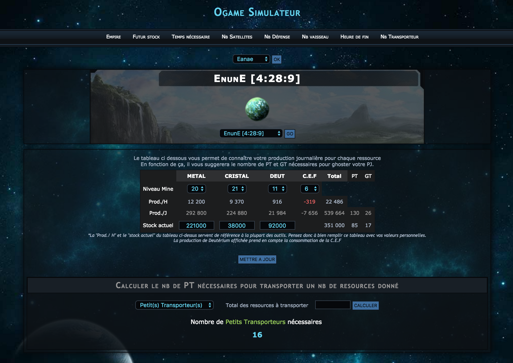

# ogame
Application d'aide pour le jeu online ogame. 
Cette application n'a pas pour but de remplacer les divers simulateurs déjà existant. 
L'application est responsive et s'adapte donc au format mobile.
  

<h2> Prérequis </h2>
Avoir un serveur hébergeur ou bien un hôte virtuel local (auquel cas l'application ne sera pas accessible via smartphone, en toute logique).

<h2>Outils de l'application </h2>
- Mode empire (mise à jour manuel du niveau des Mines mais calcul auto de la production Heure et Jour)
- Calcul d'un stock futur en fonction du stock actuel renseigné et de la production/H de la resource
- Calcul du temps nécessaire pour obtenir une resource donnée en fonction du stock actuel renseigné et de la production/H de la resource
- Calcul du nombre de satellites nécessaires pour couvrir un valeur d'énergie souhaitée (indication du côut de construction)
- Calcul du nombre de défenses (par types) possibles en fonction du stock actuel renseigné
- Calcul du nombre de vaisseaux (par types) possibles en fonction du stock actuel renseigné
- Calcul de l'heure (et du jour) de fin d'une construction en fonction du temps restant
- Calcul du nombre de PT ou GT minimum nécessaires pour transporter un nombre donné de resources

